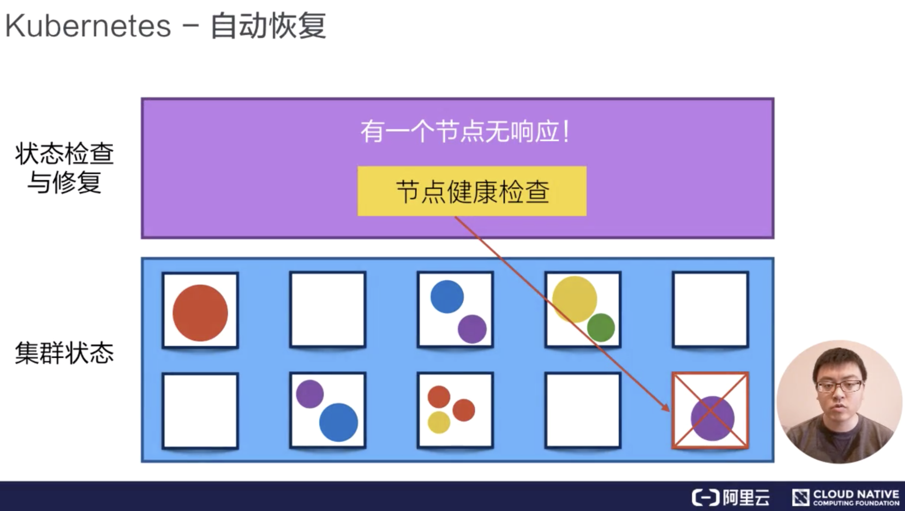

# Kubernetes 核心概念

## 什么是 Kubernetes

简称 k8s（中间 ubernete 8 个字母替换为 8），一个工业级的容器编排平台。

kubernetes 本义舵手，由容器 container 另一个含义“集装箱”引申而来，寓意 k8s 是一艘艘载满了集装箱的舵手。

## Kubernetes 核心功能

- 负载均衡

- 自动装箱（调度）

  scheduling.png

- 自动化容器恢复（对失效机器的容器进行迁移）

  

  

- 自动发布与应用回滚

- 批量执行 job 类型任务

- 水平伸缩（容器多机器部署）

  

  

## 参考资料

1. 《从零开始入门 K8s：详解 K8s 核心概念》，李响，2019 年 9 月 26 日 10:33，https://www.infoq.cn/article/KNMAVdo3jXs3qPKqTZBw