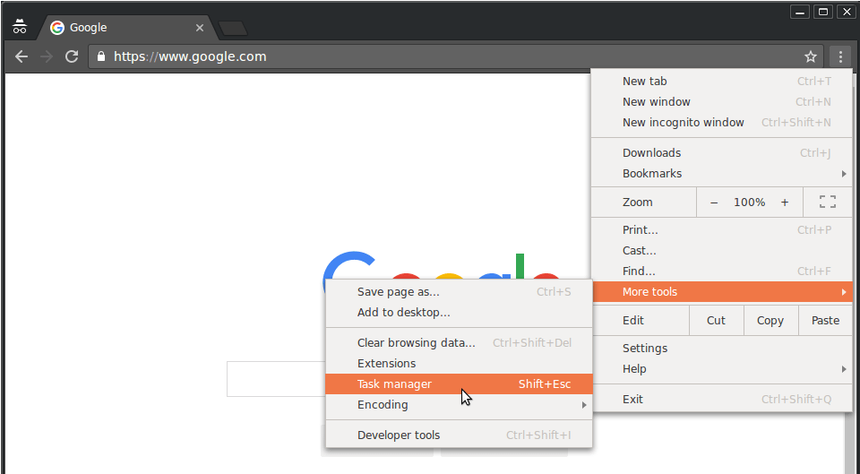
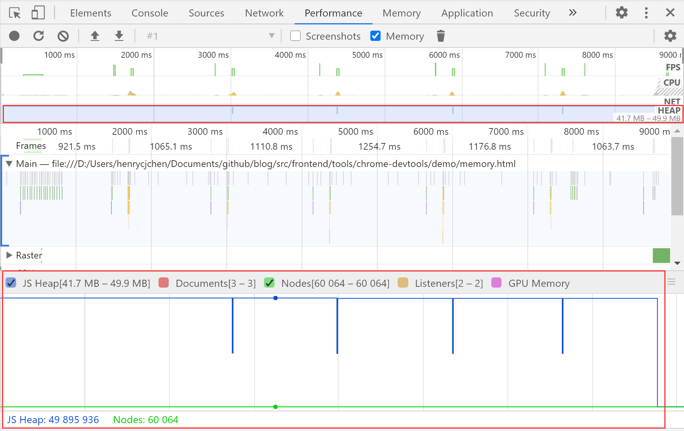
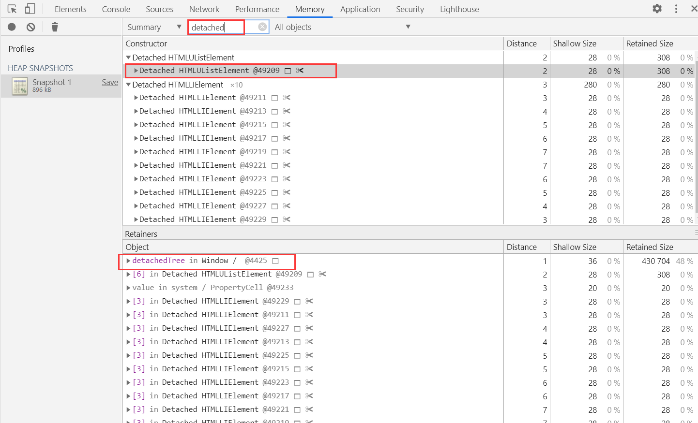
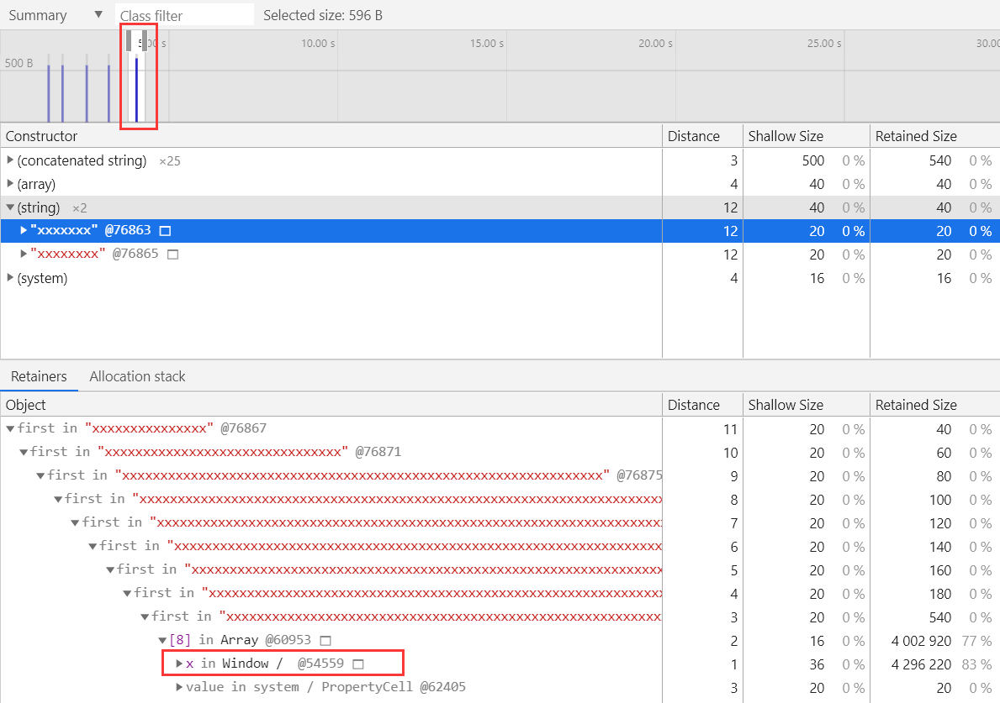

[toc]

## TL;DR

- 使用 Chrome 的任务管理器了解您的页面当前正在使用的内存量。
- 使用 Timeline 记录可视化一段时间内的内存使用。
- 使用堆快照确定已分离的 DOM 树（内存泄漏的常见原因）。
- 使用分配时间线记录了解新内存在 JS 堆中的分配时间。

### 使用 chrome 任务管理器实时监视内存使用

1. `shift` + `esc` 唤起任务管理器

   

2. 右键点击表格标题并启用 **JavaScript Memory** 

3. 以下两列说明了相关页面的有关信息

   - **Memory** 列表示原生内存。DOM 节点存储在原生内存中。 如果此值正在增大，则说明正在创建 DOM 节点。

   - **JavaScript Memory** 列表示 JS 堆。此列包含两个值。 您感兴趣的值是实时数字（括号中的数字）。 实时数字表示您的页面上的可到达对象正在使用的内存量。 如果此数字在增大，要么是正在创建新对象，要么是现有对象正在增长。

### 使用 Timeline 记录可视化内存泄漏

Timeline 面板可以帮助你了解页面在一段时间内的内存使用情况

1. 运行 `./demo/demo1.html`
2. 在 DevTools 上打开 **Performance** 面板
3. 启用 Memory 复选框
4. 做记录

如果 JS 堆大小或节点大小不断增大，则可能存在内存泄漏

### 使用堆快照发现已分离 DOM 树的内存泄漏

当 DOM 树或 JS 代码不再引用 DOM 节点时，DOM 节点才会被作为垃圾进行回收。如果某个节点已从 DOM 树移除，但 JS 中仍然引用它，则称此节点“已分离”，是内存泄漏的常见原因。

使用 DevTools 的堆分析器可以找到已分离的节点。

1. 运行 `./demo/demo2.html`

2. 点击页面上 `create`，生成已分离节点

3. 在 DevTools 上打开 **Memory** 面板

4. 选择 **Heap snapshot**

5. 点击 **Take snapshot**

6. 在 **Class filter** 中输入 `Detached`，搜索已分离的 DOM 树

   

   

### 使用分配时间线确定 JS 堆内存泄漏

分配时间线是用于跟踪 JS 堆中内存泄漏的另一种工具。

操作方式：

1. 运行 **demo3.html**

2. 打开 DevTools 的 Memory 面板

3. 选择 **Allocation instrumentation on timeline**，点击 start 开始记录

4. 点击页面上 grow 按钮，会在内存分配时间线上产生蓝色竖线

5. 选中某条蓝色竖线，可以查看它被分配到的具体变量

   

### 按函数调查内存分配

## 参考资料

1. <解决内存问题>, https://developers.google.cn/web/tools/chrome-devtools/memory-problems